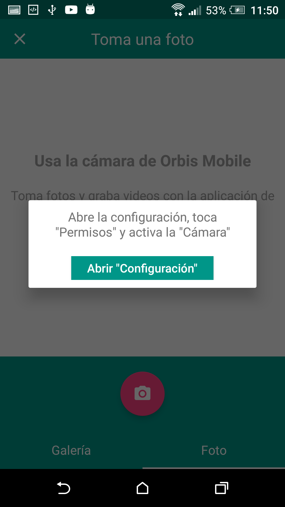

# Android Runtime Permissions with TabLayout 

One day I wonder, how Does Instagram handle the gallery of images and camera to edit the user profile ?. And I said nothing is impossible, if they are the best so are we.

#ScreenShots

#Support

Min SDK
14 (Android 4.0–4.0.2 Ice Cream Sandwich)
Target SDK
23 (Android 6.0 Marshmallow)

#About us

We are a team of mobile developers in Orbis Ventures mobiles S.A.C.
We create software and are very competitive, the application development is our passion, and we want to be the best in the world

Nothing is impossible, with effort and dedication can achieve

